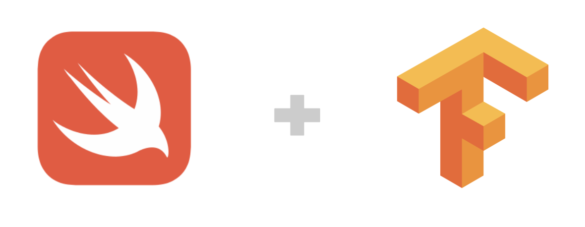

# Swift for TensorFlow (Huan）



> "Swift for Tensorflow is an attempt to change the default tools used by the entire machine learning and data science ecosystem."
>
> -- Jameson Toole,  Co-founder & CTO of Fritz.ai

## Swift for TensorFlow (S4TF)简介

Google 推出的 Swift for TensorFlow （简称S4TF）是专门针对 Tensorflow 优化过的 Swift 版本。（目前 Swift for Tensorflow 处在 Pre-Alpha 阶段）

Swift 语言是 Chris Lattner 在苹果公司工作时创建的。 现在 Chris Lattner 在 Google Brain 工作，专门从事深度学习的研究，并为 Swift 重写了编译器，为 Tensorflow 做定制优化，

为了能够在程序语言级支持 Tensorflow 所需的所有功能特性，S4TF 做为了 Swift 语言本身的一个分支，为 Swift 语言添加了机器学习所需要的所有功能扩展。它不仅仅是一个用 Swift 写成的 TensorFlow API 封装，Google 还为 Swift 增加了编译器和语言增强功能，提供了一种新的编程模型，结合了图的性能、Eager Execution的灵活性和表达能力。

本章我们将向大家简要介绍 Swift for Tensorflow 的使用。你可以参考最新的 [Swift for TensorFlow 文档](https://www.tensorflow.org/swift).

## 为什么要使用 Swift 进行 Tensorflow 开发

相对于 Tensorflow 的其他版本（如 Python，C++ 等），S4TF 拥有其独有的优势，比如：

1. 开发效率高：强类型语言，能够静态检查变量类型
1. 迁移成本低：与 Python，C，C++ 能够无缝结合
1. 执行性能高：能够直接编译为底层硬件代码
1. 专门为机器学习打造：语言原生支持自动微分系统

与其他语言相比，S4TF 还有更多优势。谷歌正在大力投资，使 Swift 成为其 TensorFlow ML 基础设施的一个关键组件，而且很有可能 Swift 将成为深度学习的专属语言。

更多使用 Swift 的理由，有兴趣的读者可以参考官方文档：[Why Swift for Tensorflow](https://github.com/tensorflow/swift/blob/master/docs/WhySwiftForTensorFlow.md)

## 在 Colaboratory 中快速体验 Swift for Tensorflow

Google 的 Colaboratory 可以直接支持 Swift 语言的运行环境。可以通过下面的链接，直接打开一个 Swift 运行环境的 Colab Notebook ，这是一个最方便立即可以体验 Swift for Tensorflow 的方法。

Blank Swift on Colab: <https://colab.research.google.com/github/tensorflow/swift/blob/master/notebooks/blank_swift.ipynb>

## 在 Docker 中快速体验 Swift for TensorFlow

在本机已有 docker 环境的情况下, 使用预装 Swift for TensorFlow 的 Docker Image 是非常方便的。

1. 获得一个已经安装好 S4TF 的 Swift REPL 环境
    在命令行中执行 ``docker run -it --privileged --userns=host zixia/swift swift``
1. 获得一个 S4TF 的 Bash 终端
    在命令行中执行 ``docker run -it --privileged --userns=host zixia/swift bash`` 来打开一个 Bash 终端
1. 获得一个 S4TS 的 Jupyter Notebook
    在命令行中执行 `nvidia-docker run -ti --rm -p 8888:8888 --cap-add SYS_PTRACE -v "$(pwd)":/notebooks zixia/swift` 来启动 Jupyter ，然后根据提示的 URL ，打开浏览器访问即可。

如需执行您需要的 Swift 代码文件, 可以使用 Docker 的目录映射。详细使用方法可以参考 Docker Image `zixia/swift` 开源项目的地址：<https://github.com/huan/docker-swift-tensorflow>

## 本地安装 Swift for Tensorflow

目前 S4TF 支持 Mac 和 Linux 两个运行环境。安装需要下载预先编译好的软件包，同时按照对应的操作系统的说明进行操作。安装后，即可以使用全套 Swift 工具，包括 Swift（Swift REPL / Interpreter）和 Swiftc（Swift编译器）。

官方文档（含下载地址）：<https://github.com/tensorflow/swift/blob/master/Installation.md>

## 基础使用

Swift 是动态强类型语言，也就是说 Swift 支持通过编译器自动检测类型，同时要求变量的使用要严格符合定义，所有变量都必须先定义后使用。

下面的代码，因为最初声明的 `n` 是整数类型（42），所以如果将 `'string'` 赋值给 `n` 时，会出现类型不匹配的问题，所以 Swift 将会报错：

```swift
var n = 42
n = "string"
```

报错输出：

> Cannot assign value of type 'String' to type 'Int'

下面是一个基础使用 Tensorflow 计算的例子：

```swift
import TensorFlow

// 声明两个Tensor
let x = Tensor<Float>([1])
let y = Tensor<Float>([2])

// 对两个 Tensor 做加法运算
let w = x + y

// 输出结果
print(w)
```

## 标准的 Tensorflow API

在基础的 Tensorflow API 上，Swift 封装了 Tensorflow 的标准 API 接口。比如看一下处理数字的代码，API 与 Tensorflow 高度保持了一致：

```swift
let x = Tensor<BFloat16>(zeros: [32, 128])
let h1 = sigmoid(x • w1 + b1)
let h2 = tanh(h1 • w1 + b1)
let h3 = softmax(h2 • w1 + b1)
```

再比如 Data API ，也是同名函数直接改写为 Swift 语法即可直接使用：

```swift
let imageBatch = Dataset(elements: images)
let labelBatch = Dataset(elements: labels)
let zipped = zip(imageBatch, labelBatch).batched(8)

let imageBatch = Dataset(elements: images)
let labelBatch = Dataset(elements: labels)
for (image, label) in zip(imageBatch, labelBatch) {
    let y = image • w + b
    let loss = (y - label).squared().mean()
    print(loss)
}
```

## 直接加载 Python 语言库

Swift 语言支持直接加载 Python 函数库（比如 Numpy ），也支持直接加载系统动态链接库，很方便的做到既导入既用。

借助 S4TF 强大的集成能力，从 Python 迁移到 Swift 非常简单。您可以逐步迁移 Python 代码（或继续使用 Python 代码库），因为 S4TF 支持直接在代码中加载 Python 原生代码库，使得开发者可以继续使用熟悉的语法在 Swift 中调用 Python 中已经完成的功能。

下面我们以 Numpy 为例，看一下如何在 Swift 语言中，直接加载 Python 的 Numpy 代码库，并且直接进行调用：

```swift
import Python

let np = Python.import("numpy")
let x = np.array([[1, 2], [3, 4]])
let y = np.array([11, 12])
print(x.dot(y))
```

输出：

> [35 81]

除了能够直接调用 Python 之外，Swift 也快成直接调用系统函数库。比如下面的代码例子展示了我们可以在 Swift 中直接加载 Glibc 的动态库，然后调用系统底层的 malloc 和 memcpy 函数，对变量直接进行操作。

```swift
import Glibc
let x = malloc(18)
memcpy(x, "memcpy from Glibc", 18)
free(x)
```

通过 Swift 强大的集成能力，针对 C/C++ 语言库的加载和调用，处理起来也将会是非常简单高效。

## 语言原生支持自动微分

我们可以通过 `@differentiable` 参数，非常容易的定义一个可被微分的函数。

```swift
@differentiable
func frac(_ x:Double) -> Double {
  return 1/x
}

gradient(at:0.5) { x in frac(x) }
```

输出：

> -4.0

## MNIST 数字分类

本小节的源代码可以在 <https://github.com/huan/tensorflow-handbook-swift> 找到。加载 `MNIST` 数据集使用了作者封装的 Swift Module [swift-MNIST](https://github.com/huan/swift-MNIST)。

更方便的是在 Google Colab 上直接打开本例子的 Jupyter 直接运行，地址：<https://colab.research.google.com/github/huan/tensorflow-handbook-swift/blob/master/tensorflow-handbook-swift-example.ipynb>（推荐）

代码：

```swift
import TensorFlow
import Python
import Foundation

/**
 * The Swift Module for MNIST Dataset:
 * https://github.com/huan/swift-MNIST
 */
import MNIST

struct MLP: Layer {
  typealias Input = Tensor<Float>
  typealias Output = Tensor<Float>

  var flatten = Flatten<Float>()
  var dense = Dense<Float>(inputSize: 784, outputSize: 10)
  
  @differentiable
  public func callAsFunction(_ input: Input) -> Output {
    return input.sequenced(through: flatten, dense)
  }  
}

var model = MLP()
let optimizer = Adam(for: model)

let mnist = MNIST()
let ((trainImages, trainLabels), (testImages, testLabels)) = mnist.loadData()

let imageBatch = Dataset(elements: trainImages).batched(32)
let labelBatch = Dataset(elements: trainLabels).batched(32)

for (X, y) in zip(imageBatch, labelBatch) {
  // Caculate the gradient
  let (_, grads) = valueWithGradient(at: model) { model -> Tensor<Float> in
    let logits = model(X)
    return softmaxCrossEntropy(logits: logits, labels: y)
  }

  // Update parameters by optimizer
  optimizer.update(&model.self, along: grads)
}

let logits = model(testImages)
let acc = mnist.getAccuracy(y: testLabels, logits: logits)

print("Test Accuracy: \(acc)" )
```

以上程序运行输出为：

```text
Downloading train-images-idx3-ubyte ...
Downloading train-labels-idx1-ubyte ...
Reading data.
Constructing data tensors.
Test Accuracy: 0.9116667
```
